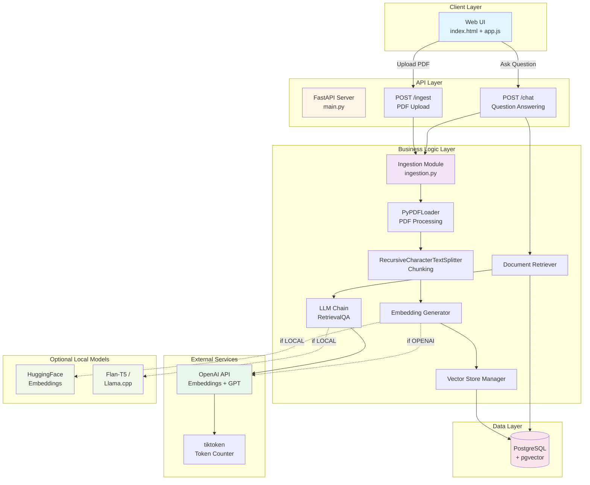
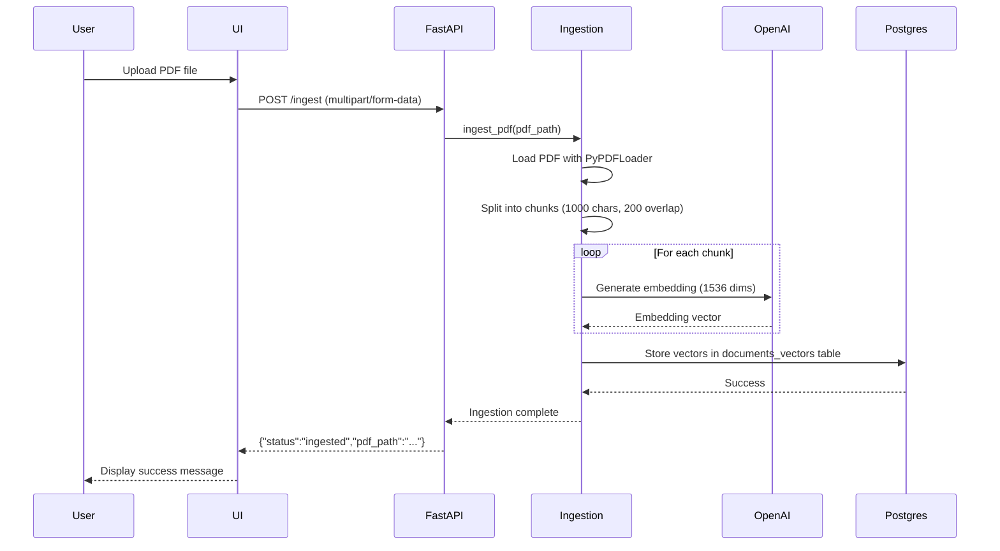
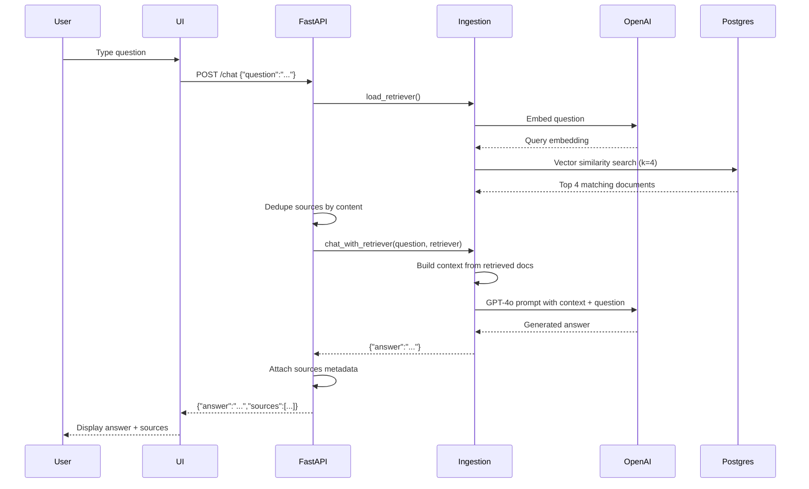
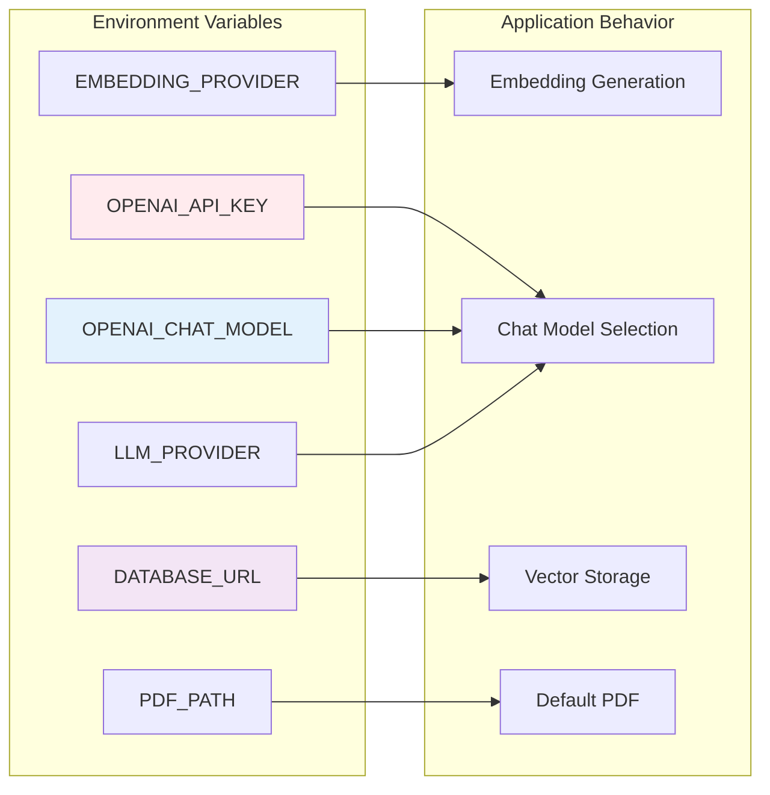
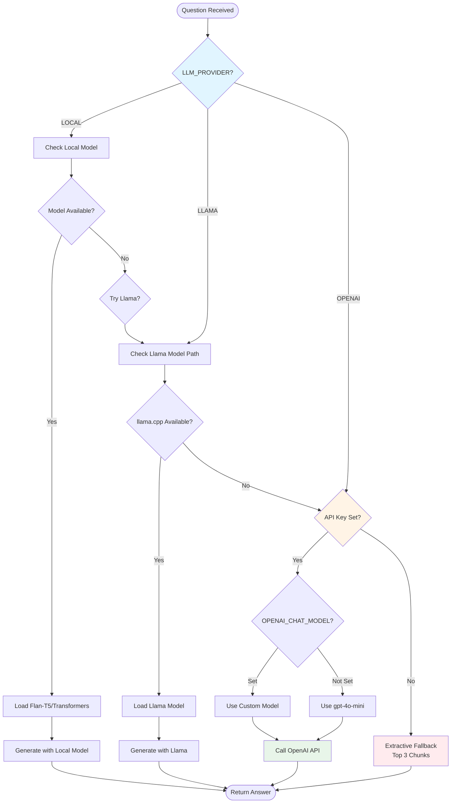
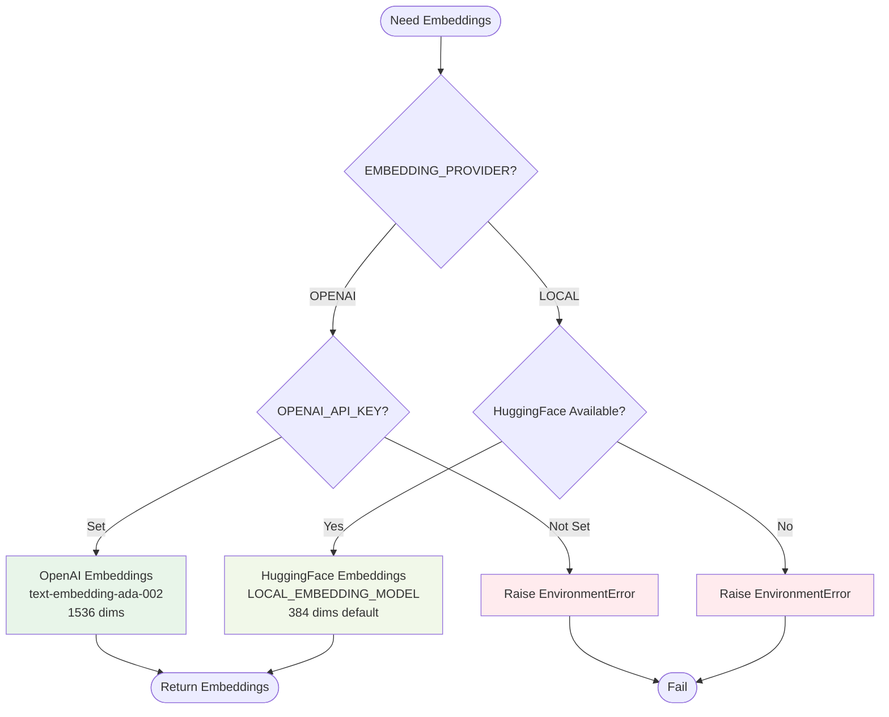
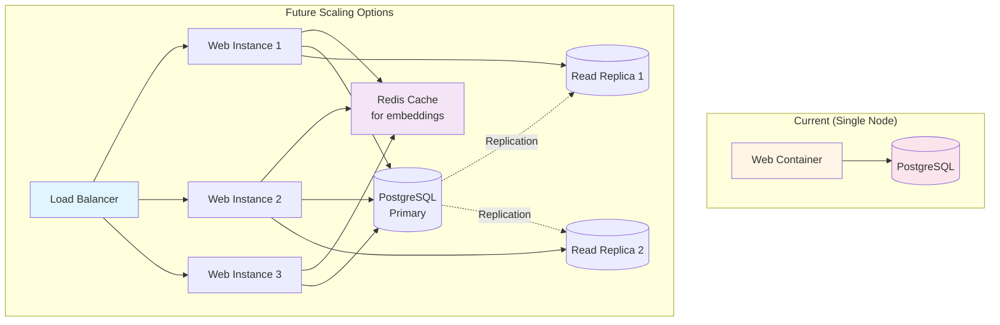
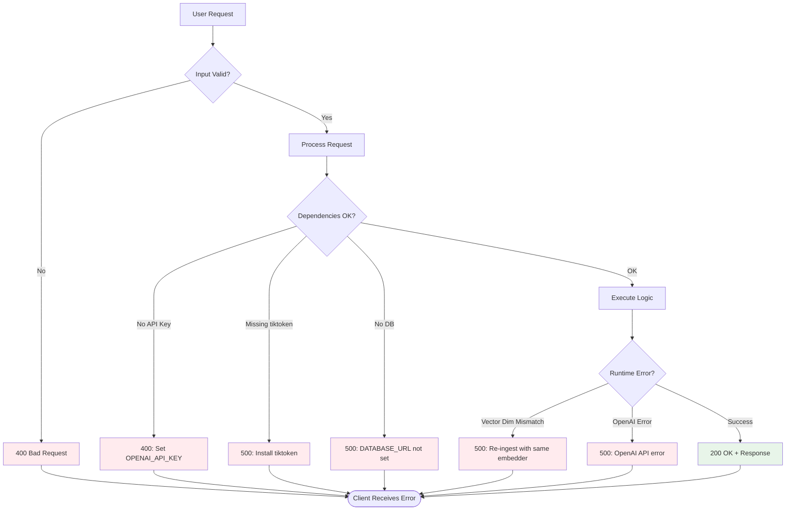

# Architecture Documentation

## System Overview

This is a RAG (Retrieval-Augmented Generation) application that ingests PDF documents, stores them in a vector database, and answers questions using OpenAI's GPT models with context from the retrieved documents.

## High-Level Architecture (ASCII)

```
┌─────────────────────────────────────────────────────────────────────┐
│                         User Interface (Browser)                     │
│                        index.html + app.js                          │
└────────────────────────────┬────────────────────────────────────────┘
                             │
                             │ HTTP Requests
                             ▼
┌─────────────────────────────────────────────────────────────────────┐
│                      FastAPI Backend (main.py)                       │
│  ┌──────────────────┐           ┌──────────────────────────────┐   │
│  │  /ingest         │           │  /chat                       │   │
│  │  Upload PDF      │           │  Question Answering          │   │
│  └────────┬─────────┘           └──────────┬───────────────────┘   │
│           │                                 │                       │
│           │                                 │                       │
│           └────────────────┬────────────────┘                       │
│                            │                                        │
│                            ▼                                        │
│               ┌────────────────────────────┐                        │
│               │   Ingestion Module         │                        │
│               │   (ingestion.py)           │                        │
│               │                            │                        │
│               │  • PDF Loading             │                        │
│               │  • Text Splitting          │                        │
│               │  • Embedding Generation    │                        │
│               │  • Vector Storage          │                        │
│               │  • Retrieval               │                        │
│               │  • LLM Integration         │                        │
│               └────────┬───────────────────┘                        │
└────────────────────────┼────────────────────────────────────────────┘
                         │
          ┌──────────────┼──────────────┐
          │              │              │
          ▼              ▼              ▼
┌─────────────────┐ ┌──────────┐ ┌────────────────┐
│ OpenAI API      │ │PostgreSQL│ │ Local Models   │
│                 │ │+ pgvector│ │ (Optional)     │
│ • Embeddings    │ │          │ │                │
│ • GPT-4o/mini   │ │ Vector   │ │ • Flan-T5      │
│ • tiktoken      │ │ Search   │ │ • Llama.cpp    │
└─────────────────┘ └──────────┘ └────────────────┘
```

## Component Architecture (Mermaid)



## Data Flow Diagrams

### Ingestion Flow



### Question Answering Flow



## Technology Stack

### Frontend
```
┌─────────────────────────────────────┐
│ HTML5 + Vanilla JavaScript          │
│ • index.html (UI structure)         │
│ • app.js (API calls & rendering)    │
│ • Fetch API for HTTP requests       │
└─────────────────────────────────────┘
```

### Backend
```
┌─────────────────────────────────────┐
│ Python 3.11                         │
│ ├─ FastAPI (web framework)          │
│ ├─ Uvicorn (ASGI server)            │
│ ├─ LangChain (RAG orchestration)    │
│ ├─ PyPDF (PDF parsing)              │
│ └─ python-dotenv (config)           │
└─────────────────────────────────────┘
```

### AI/ML Stack
```
┌─────────────────────────────────────┐
│ OpenAI Integration (Primary)        │
│ ├─ text-embedding-ada-002           │
│ │  (1536 dimensions)                │
│ ├─ GPT-4o / GPT-4o-mini             │
│ └─ tiktoken (tokenization)          │
│                                     │
│ Optional Local Models               │
│ ├─ HuggingFace Transformers         │
│ │  • Flan-T5 (seq2seq)              │
│ │  • sentence-transformers          │
│ └─ llama-cpp-python (Llama)         │
└─────────────────────────────────────┘
```

### Database
```
┌─────────────────────────────────────┐
│ PostgreSQL 15+                      │
│ └─ pgvector extension               │
│    • Vector similarity search       │
│    • Cosine distance operator       │
│    • HNSW indexing (optional)       │
└─────────────────────────────────────┘
```

### Infrastructure
```
┌─────────────────────────────────────┐
│ Docker + Docker Compose             │
│ ├─ db service (ankane/pgvector)     │
│ └─ web service (Python 3.11-slim)   │
│                                     │
│ Volumes                             │
│ └─ pgdata (persist database)        │
└─────────────────────────────────────┘
```

## Configuration Architecture



## Directory Structure (ASCII Tree)

```
ai_tryouts/
│
├── backend/                    # Python application code
│   ├── __pycache__/           # Python bytecode cache
│   ├── main.py                # FastAPI app & endpoints
│   └── ingestion.py           # RAG logic (ingest, retrieve, chat)
│
├── static/                    # Frontend assets
│   ├── index.html             # Web UI structure
│   └── app.js                 # Client-side JavaScript
│
├── db/                        # Local database files (dev)
│
├── docker/                    # Docker helper scripts
│   └── wait-for-db.sh         # Database readiness check
│
├── models/                    # Local model storage (optional)
│   └── (ggml-model.bin)       # Llama models (if using)
│
├── .env                       # Environment configuration (secrets)
├── .env.example               # Template for .env
├── .gitignore                 # Git exclusions
│
├── Dockerfile                 # Container build instructions
├── docker-compose.yml         # Multi-container orchestration
│
├── requirements.txt           # Python dependencies (local dev)
├── requirements-docker.txt    # Python dependencies (container)
│
├── ARCHITECTURE.md            # This file
└── README.md                  # Project documentation
```

## Deployment Topology

```
┌───────────────────────────────────────────────────────────────────┐
│                         Docker Host                                │
│                                                                    │
│  ┌─────────────────────────────────────────────────────────────┐  │
│  │  ai_tryouts_default Network                                 │  │
│  │                                                              │  │
│  │  ┌──────────────────────┐      ┌──────────────────────┐    │  │
│  │  │  ai_tryouts-web-1    │      │  ai_tryouts-db-1     │    │  │
│  │  │                      │      │                      │    │  │
│  │  │  Python 3.11         │      │  PostgreSQL + pgvect │    │  │
│  │  │  FastAPI + Uvicorn   │─────▶│                      │    │  │
│  │  │  Port: 8000          │      │  Port: 5432          │    │  │
│  │  │                      │      │                      │    │  │
│  │  │  Volume: ./:/app     │      │  Volume: pgdata      │    │  │
│  │  └──────────┬───────────┘      └──────────────────────┘    │  │
│  │             │                                               │  │
│  └─────────────┼───────────────────────────────────────────────┘  │
│                │                                                   │
└────────────────┼───────────────────────────────────────────────────┘
                 │
                 │ Port Mapping
                 ▼
      ┌──────────────────────┐
      │  Host Machine        │
      │  localhost:8000      │
      └──────────────────────┘
```

## LLM Provider Selection Flow



## Embedding Provider Selection



## Key Design Decisions

### 1. Embedding Dimension Consistency
- **Issue**: OpenAI embeddings (1536d) vs local models (384d) incompatibility
- **Solution**: Environment-based provider selection, must re-ingest when switching
- **Trade-off**: Storage size vs accuracy (OpenAI is larger but more accurate)

### 2. LLM Fallback Chain
1. **Primary**: OpenAI (gpt-4o/gpt-4o-mini) - best quality
2. **Secondary**: Local Transformers (Flan-T5) - offline capability
3. **Tertiary**: Llama.cpp - GGML models for resource efficiency
4. **Fallback**: Extractive (no LLM) - always works

### 3. Vector Store Strategy
- **Choice**: PostgreSQL + pgvector
- **Rationale**: 
  - Single database (no separate vector DB needed)
  - SQL familiarity for queries
  - ACID transactions
  - Built-in persistence
- **Alternative considered**: FAISS (faster but in-memory only)

### 4. Chunking Strategy
- **Size**: 1000 characters
- **Overlap**: 200 characters
- **Rationale**: Balance between context preservation and retrieval precision

### 5. Retrieval Count (k=4)
- **Default**: Top 4 most similar chunks
- **Rationale**: Fits in most LLM context windows while providing sufficient context
- **Configurable**: Can be adjusted in `load_retriever()`

## Security Considerations

```
┌─────────────────────────────────────────────────────────────┐
│ Security Layer                                              │
│                                                             │
│  1. Environment Variables (.env)                            │
│     • OPENAI_API_KEY (never commit)                         │
│     • DATABASE_URL (credentials)                            │
│     • .gitignore protects secrets                           │
│                                                             │
│  2. Network Isolation (Docker)                              │
│     • db service only accessible via internal network       │
│     • web service exposes only port 8000                    │
│                                                             │
│  3. Input Validation                                        │
│     • FastAPI Pydantic models (ChatRequest)                 │
│     • File type checking (PDF only)                         │
│                                                             │
│  4. Dependency Management                                   │
│     • Pinned versions in requirements.txt                   │
│     • Docker BuildKit cache for reproducibility             │
└─────────────────────────────────────────────────────────────┘
```

## Performance Characteristics

| Operation | Typical Latency | Bottleneck |
|-----------|----------------|------------|
| PDF Ingestion (100 pages) | 30-60s | OpenAI API rate limits |
| Embedding Generation | ~1s per 10 chunks | OpenAI API |
| Vector Search (k=4) | <50ms | PostgreSQL query |
| LLM Response (GPT-4o) | 2-5s | OpenAI API |
| End-to-End Query | 3-6s | LLM generation |

## Scalability Considerations



## Monitoring & Observability

### Logs
- **Container Logs**: `docker compose logs web -f`
- **Database Logs**: `docker compose logs db -f`
- **Format**: Uvicorn access logs + Python print statements

### Metrics to Monitor
1. **Ingestion**:
   - Documents ingested per hour
   - Average chunk count per document
   - Embedding generation time
   - Vector storage latency

2. **Query**:
   - Questions per minute
   - Average response time
   - Retrieval precision (user feedback)
   - OpenAI API quota usage

3. **Infrastructure**:
   - Container CPU/memory usage
   - PostgreSQL query performance
   - Vector table size
   - Disk usage (pgdata volume)

## Error Handling Flow



## Development Workflow

```
Developer Workflow
──────────────────

1. Code Changes
   ├─ Edit backend/*.py
   ├─ Edit static/*.{html,js}
   └─ Edit requirements*.txt

2. Local Testing
   ├─ docker compose up --build
   └─ curl localhost:8000/chat

3. Logs & Debug
   └─ docker compose logs -f

4. Iterate
   ├─ Fix code
   └─ Rebuild container

5. Commit (git flow)
   ├─ .env stays local (gitignored)
   └─ Push changes
```

## API Endpoints Reference

### POST /ingest
**Purpose**: Upload and process a PDF document

**Request**:
```http
POST /ingest HTTP/1.1
Content-Type: multipart/form-data

pdf: <file>
```

**Response**:
```json
{
  "status": "ingested",
  "pdf_path": "./document.pdf"
}
```

### POST /chat
**Purpose**: Ask a question and get an AI-generated answer

**Request**:
```http
POST /chat HTTP/1.1
Content-Type: application/json

{
  "question": "What does Citus provide?"
}
```

**Response**:
```json
{
  "answer": "Citus provides...",
  "sources": [
    {
      "source": "./document.pdf",
      "text": "First 400 chars of relevant chunk..."
    }
  ]
}
```

### GET /
**Purpose**: Serve the web UI

**Response**: HTML page (index.html)

---

## Future Enhancements

1. **Authentication & Multi-tenancy**
   - User accounts
   - Per-user document isolation
   - API key management

2. **Advanced Retrieval**
   - Hybrid search (keyword + vector)
   - Reranking with cross-encoders
   - Query expansion

3. **Observability**
   - Prometheus metrics
   - Grafana dashboards
   - Distributed tracing

4. **Performance**
   - Embedding caching
   - Response streaming
   - Async batch processing

5. **Features**
   - Multi-document support
   - Citation tracking
   - Conversation history
   - Export to markdown/PDF
