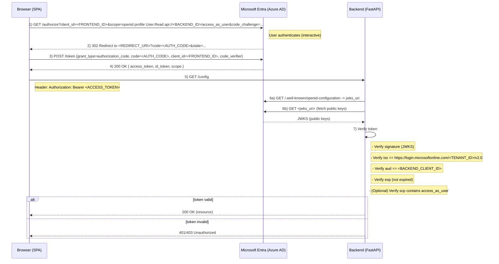

# Microsoft Entra (Azure AD) Authentication Setup

This document provides a complete guide to setting up Microsoft Entra (formerly Azure Active Directory) authentication for the RAG Chat application.

## Table of Contents
1. [Overview](#overview)
2. [Azure Portal Setup](#azure-portal-setup)
3. [Backend Configuration](#backend-configuration)
4. [Frontend Configuration](#frontend-configuration)
5. [Testing](#testing)
6. [Troubleshooting](#troubleshooting)

## Overview

The application uses Microsoft Entra for authentication with the following architecture:
- **Frontend**: Uses MSAL (Microsoft Authentication Library) for browser-based authentication
- **Backend**: Validates JWT tokens issued by Microsoft Entra
- **Flow**: OAuth 2.0 Authorization Code Flow with PKCE

## Azure Portal Setup

### Step 1: Create an App Registration

1. Navigate to the [Azure Portal](https://portal.azure.com)
2. Go to **Azure Active Directory** → **App registrations** → **New registration**
3. Fill in the following:
   - **Name**: RAG Chat Application (or your preferred name)
   - **Supported account types**: Choose based on your needs:
     - Single tenant (only your organization)
     - Multi-tenant (any organization)
     - Personal Microsoft accounts (for testing)
   - **Redirect URI**: 
     - Platform: Single-page application (SPA)
     - URI: `http://localhost:5173` (for development)
4. Click **Register**

### Step 2: Configure Authentication

1. In your app registration, go to **Authentication**
2. Under **Single-page application**, add redirect URIs:
   - `http://localhost:5173` (development)
   - Your production URL (e.g., `https://yourapp.com`)
# Microsoft Entra (Azure AD) Authentication — Setup & Verification

This document shows the exact steps to register the frontend (SPA) and backend (API) applications in Microsoft Entra (Azure AD), configure environment variables used by this project, and verify the end-to-end authentication flow locally.

This repository expects the following env var conventions:

- Frontend (Vite) envs (file: `frontend/.env`):
   - `VITE_AZURE_FRONTEND_TENANT_ID` — Directory (tenant) ID
   - `VITE_AZURE_FRONTEND_CLIENT_ID` — Frontend (SPA) Application (client) ID
   - `VITE_REDIRECT_URI` — SPA redirect URI (development default: `http://localhost:5173`)
   - `VITE_AZURE_BACKEND_CLIENT_ID` — Backend (API) Application (client) ID (used to build scope)
   - `VITE_AZURE_BACKEND_SCOPE` — Full scope URI (optional). If not set, the code builds `api://<VITE_AZURE_BACKEND_CLIENT_ID>/access_as_user`
   - `VITE_API_URL` — Backend base URL (e.g. `http://localhost:8000`)

- Backend envs (file: `.env` at repository root or process env):
   - `AZURE_TENANT_ID` — Directory (tenant) ID (must match the frontend tenant)
   - `AZURE_CLIENT_ID` — Backend (API) Application (client) ID
   - (optional) `AZURE_CLIENT_SECRET` — only needed for confidential flows on the backend

Everything below assumes a dev setup on `localhost` (frontend on :5173, backend on :8000).

---

## 1) Register Backend (API) app in Azure

1. In Azure Portal → Azure Active Directory → App registrations → New registration
    - Name: `rag-chat-backend` (or your name)
    - Supported account types: choose as needed (usually Single tenant for internal use)
    - Redirect URI: *leave blank* for API app (not required)
    - Click Register

2. Record values from the Overview page:
    - Directory (tenant) ID → use for `AZURE_TENANT_ID`
    - Application (client) ID → use for `AZURE_CLIENT_ID` and `VITE_AZURE_BACKEND_CLIENT_ID`

3. Expose an API (create a delegated scope):
    - In the backend app registration → **Expose an API**
    - If Application ID URI is empty, set it to `api://<APPLICATION_CLIENT_ID>` (Azure will suggest one)
    - Click **Add a scope**
       - Scope name: `access_as_user`
       - Who can consent: `Admins and users`
       - Admin consent display name: `Access RAG Chat API`
       - Admin consent description: `Allow the app to access the RAG Chat API on behalf of the signed-in user.`
       - Click **Add scope**
    - After this, your full scope URI will be `api://<BACKEND_CLIENT_ID>/access_as_user`

4. (Optional) App roles: if you want RBAC, add `App roles` in the manifest or via the App roles UI and assign users/groups in Enterprise Applications.

---

## 2) Register Frontend (SPA) app in Azure

1. Azure AD → App registrations → New registration
    - Name: `rag-chat-frontend` (or your name)
    - Supported account types: same tenant as backend (recommended)
    - Redirect URI: Platform: Single-page application (SPA)
       - URI: `http://localhost:5173`
    - Click Register

2. Configure Authentication
    - In the frontend app registration → **Authentication**
       - Under **Platform configurations**, ensure **Single-page application** platform is configured and `http://localhost:5173` is added as a redirect URI
       - Do NOT enable the implicit grant options; MSAL (Authorization Code + PKCE) is used.

3. Configure API permissions
    - In **API permissions** → **Add a permission** → **My APIs** → select the backend app you created
    - Choose **Delegated permissions** → check the `access_as_user` scope you created
    - Also add **Microsoft Graph → Delegated → User.Read** (used for display name/profile)
    - Click **Add permissions**
    - Click **Grant admin consent** (requires an admin) — this avoids per-user consent prompts in dev.

4. Note values to set in frontend `.env`:
    - Directory (tenant) ID → `VITE_AZURE_FRONTEND_TENANT_ID`
    - Application (client) ID → `VITE_AZURE_FRONTEND_CLIENT_ID`
    - Backend client id (from the backend app) → `VITE_AZURE_BACKEND_CLIENT_ID`
    - Optionally, `VITE_AZURE_BACKEND_SCOPE` → `api://<BACKEND_CLIENT_ID>/access_as_user`

---

## 3) Configure the repository environment files

- `frontend/.env` (example):

```ini
# Frontend dev
VITE_API_URL=http://localhost:8000
VITE_AZURE_FRONTEND_TENANT_ID=<TENANT_ID>
VITE_AZURE_FRONTEND_CLIENT_ID=<FRONTEND_CLIENT_ID>
VITE_REDIRECT_URI=http://localhost:5173
# Backend info used by frontend to request scope
VITE_AZURE_BACKEND_CLIENT_ID=<BACKEND_CLIENT_ID>
VITE_AZURE_BACKEND_SCOPE=api://<BACKEND_CLIENT_ID>/access_as_user
```

- Root `.env` (backend) example:

```ini
# Backend
AZURE_TENANT_ID=<TENANT_ID>
AZURE_CLIENT_ID=<BACKEND_CLIENT_ID>
# Optionally AZURE_CLIENT_SECRET if you use confidential flows
```

Notes:
- The backend `AZURE_CLIENT_ID` must match the backend app Application ID.
- `VITE_AZURE_BACKEND_SCOPE` must use the backend app id (not the tenant id).

---

## 4) How the code uses these values

- Frontend: `frontend/src/authConfig.js` builds `tokenRequest.scopes` from `VITE_AZURE_BACKEND_SCOPE` or `api://<VITE_AZURE_BACKEND_CLIENT_ID>/access_as_user`. It also uses `VITE_AZURE_FRONTEND_CLIENT_ID` and `VITE_AZURE_FRONTEND_TENANT_ID` for the MSAL client configuration.
- Backend: `backend/auth.py` loads `AZURE_TENANT_ID` and `AZURE_CLIENT_ID` and validates incoming access tokens' `issuer` and `aud` (audience) claims accordingly.

---

## 5) Local testing checklist

1. Start backend (reload env) — ensure `.env` has the backend values set

```bash
cd /path/to/repo
source .venv/bin/activate
# ensure .env is loaded by your process manager or export env vars manually
PYTHONPATH=$(pwd) uvicorn backend.main:app --host 0.0.0.0 --port 8000
```

2. Start frontend

```bash
cd frontend
npm install
npm run dev
```

3. Use the SPA to sign in. In DevTools Console run:

```js
// show MSAL accounts
window.__msal?.getAllAccounts().then(console.log)
// debug token acquisition (helper provided by project)
debugAuth().then(console.log)
```

4. Inspect access token
- Decode it (jwt.ms or jwt.io) and confirm:
   - `iss` = `https://login.microsoftonline.com/<TENANT_ID>/v2.0`
   - `aud` = `<BACKEND_CLIENT_ID>` (or the Application ID URI expected by your backend)
   - `scp` contains `api://<BACKEND_CLIENT_ID>/access_as_user`

5. Make API call with token (curl example)

```bash
curl -H "Authorization: Bearer <ACCESS_TOKEN>" http://localhost:8000/config
```

Expect HTTP 200 and valid JSON response.

---

## 6) Troubleshooting quick guide

- 401 Unauthorized
   - Verify `AZURE_TENANT_ID` and `AZURE_CLIENT_ID` are set in the backend environment and match the values from Azure.
   - Verify the token `aud` claim matches `AZURE_CLIENT_ID` or the Application ID URI your backend uses.
   - Verify the frontend requested the correct scope (`VITE_AZURE_BACKEND_SCOPE`).

- Token not being sent from the SPA
   - Verify `window.__msal` exists in the browser console
   - Ensure `debugAuth()` returns `tokenInfo.accessToken` — if not, user is not signed in or the token request failed
   - Check network tab: `Authorization` header should be present

- AADSTS50011 / reply URL mismatch
   - Ensure `VITE_REDIRECT_URI` matches the redirect URI registered in the SPA app registration

- Cross-origin or CORS errors
   - For local dev the backend allows all origins. For production add your frontend origin to the backend's CORS allow list

---

## 7) Security notes

- Do not commit `.env` files with secrets to version control
- For production, use Azure Key Vault and secure secret storage
- Restrict CORS and use HTTPS in production

---

## 8) Quick reference — env vars to set

Frontend: `frontend/.env`
```ini
VITE_AZURE_FRONTEND_TENANT_ID=<TENANT_ID>
VITE_AZURE_FRONTEND_CLIENT_ID=<FRONTEND_CLIENT_ID>
VITE_REDIRECT_URI=http://localhost:5173
VITE_AZURE_BACKEND_CLIENT_ID=<BACKEND_CLIENT_ID>
VITE_AZURE_BACKEND_SCOPE=api://<BACKEND_CLIENT_ID>/access_as_user
VITE_API_URL=http://localhost:8000
```

Backend: `.env` (repo root)
```ini
AZURE_TENANT_ID=<TENANT_ID>
AZURE_CLIENT_ID=<BACKEND_CLIENT_ID>
```

---

If you want, I can also add a small script to automate creating the `.env` files from the App Registration IDs you provide. Just tell me which IDs to use and I will create the `.env` files for you (local-only change, not committed credentials).

---

## Appendix: Auth flow (Mermaid)

The diagram below uses Mermaid's **sequenceDiagram** to show the Authorization Code + PKCE flow and where the backend validates the access token.



Short mapping (envs & claims):
- Frontend: `VITE_AZURE_FRONTEND_TENANT_ID`, `VITE_AZURE_FRONTEND_CLIENT_ID`, `VITE_AZURE_BACKEND_CLIENT_ID`, `VITE_AZURE_BACKEND_SCOPE`
- Backend: `AZURE_TENANT_ID`, `AZURE_CLIENT_ID` (expected `aud`)

If you'd like I can export this Mermaid diagram to a PNG and add it to `docs/` for visual documentation.

---

## Entra app registration structure — current setup and rationale

This project uses two separate App Registrations in Microsoft Entra (Azure AD): one for the frontend Single-Page Application (SPA) and one for the backend API. Below is a concise description of the registration structure, the exact configuration choices made, and the reasons behind them.

High-level layout
- Frontend (SPA): `rag-chat-frontend`
   - Platform: Single-page application (SPA)
   - Flow: Authorization Code + PKCE (msal-browser)
   - Redirect URI: `http://localhost:5173` (dev)
   - Permissions: Delegated permission to the backend scope (e.g. `api://<BACKEND_ID>/access_as_user`) and Graph `User.Read`

- Backend (API): `rag-chat-backend`
   - Type: Web/API (no SPA redirect URIs required)
   - Exposed API scope: `access_as_user` → full URI `api://<BACKEND_ID>/access_as_user`
   - Backend validates incoming access tokens (aud, iss, signature, exp)

Why two app registrations?
- Separation of concerns: the frontend and backend have different responsibilities and security requirements. The SPA is a public client (cannot keep secrets) and uses the Authorization Code + PKCE flow. The backend is a resource server that needs to verify tokens and may optionally accept confidential client credentials for non-interactive flows.
- Principal of least privilege: the frontend requests only the scopes it needs (frontend profile scopes + the backend's delegated scope) rather than asking for broad permissions.
- Easier token validation: by exposing a dedicated API scope on the backend app, the backend can validate access tokens by checking the `aud` claim matches its own application id (or Application ID URI). Using Graph tokens for backend calls is incorrect and will lead to audience mismatches.

Key configuration choices and reasoning
- Authorization Code + PKCE for the SPA
   - Reason: SSPAs are public clients — PKCE ensures authorization code interception attacks are mitigated and is the recommended approach for browser apps.
   - Result: MSAL (msal-browser) performs a secure code exchange and caches tokens in `sessionStorage` by default.

- Expose an API scope on the backend (`access_as_user`)
   - Reason: Produces a backend-specific scope with an audience that equals the backend's app id, enabling the backend to verify tokens unambiguously.
   - Result: Frontend requests `api://<BACKEND_ID>/access_as_user` and receives an access token whose `aud` matches the backend `AZURE_CLIENT_ID`.

- Use delegated permissions (not application permissions)
   - Reason: The app acts on behalf of a signed-in user (RAG Chat needs user context for personalization and audit), so delegated permissions are appropriate.
   - Application permissions (app-only) are more powerful and require admin consent and client secrets; we avoid them for normal user flows.

- Cache location: `sessionStorage` (frontend)
   - Reason: sessionStorage reduces long-lived risk on shared devices and mirrors a 'session' model—closing the tab removes tokens. For local development this reduces token persistence surprises. If you need persistent login across tabs and restarts, `localStorage` can be used with the caveats around XSS risk.

- Granting admin consent for dev convenience
   - Reason: In development it's easier to grant admin consent so users aren't prompted for every new permission. For production evaluate least privilege and consent strategy carefully.

Operational notes
- Redirect URIs and SPA platform: ensure the frontend registration is using the **SPA** platform (not Web). The SPA platform configuration allows the browser-based auth flow and prevents the AADSTS9002326 cross-origin restriction when exchanging tokens.
- Scopes and permission synchronization: after creating the backend scope, add it to the frontend app's API permissions and grant consent. This ensures the frontend can request the scope successfully.
- Token validation on backend: the backend fetches the tenant OpenID configuration and JWKS to validate signatures. It checks issuer to `https://login.microsoftonline.com/<TENANT_ID>/v2.0` and audience to `AZURE_CLIENT_ID`.

When to change this structure
- Single-app alternative: For very small apps you could consolidate into a single app registration that represents both the SPA and the API (expose an API and also add SPA redirect URIs). Con: mixing resource and client concerns can make role/scope management and secret handling less clear.
- Confidential backend clients: If the backend needs to perform app-only operations (no signed-in user), add a client secret/certificate to the backend app and use application permissions for those flows.

Summary
- The chosen two-app registration structure follows recommended security patterns for SPA + API designs: public client frontend with Authorization Code + PKCE, and a backend API with an explicit audience-scoped permission. This minimizes attack surface, makes token validation straightforward, and keeps permissions granular.

## Current project configuration — `rag_chat_user` role

This repository now enforces an application role named `rag_chat_user` for access to protected backend endpoints. Below is a concise reference you can copy into the backend app registration manifest or use to assign roles.

Manifest snippet to add to backend app registration (`appRoles` array):

```json
{
   "id": "11111111-2222-3333-4444-555555555555",
   "displayName": "RAGChatUser",
   "value": "rag_chat_user",
   "description": "Allows access to the RAG Chat API",
   "allowedMemberTypes": ["User"],
   "isEnabled": true
}
```

Notes:
- Replace the `id` with a generated GUID (use `uuidgen` on macOS/Linux or a GUID generator). The Azure Portal UI will create this GUID automatically if you use the App roles UI.
- After adding the role, assign it to users or groups via **Azure AD → Enterprise applications → [your backend app] → Users and groups → Add user/group**.

Backend enforcement:
- The FastAPI backend enforces this role using the `require_role('rag_chat_user')` dependency (see `backend/auth.py` and `backend/main.py`). Protected endpoints will return HTTP 403 if the authenticated user's token does not include `"roles": ["rag_chat_user"]`.

Testing:
- Assign the role to a user, sign in via the SPA, acquire an access token for the backend scope (`api://<BACKEND_ID>/access_as_user`), and call a protected endpoint. Expect 200 for assigned users and 403 for users without the role.

### Advantages of the two-app registration approach (why we chose it)

- Strong separation of concerns
   - The SPA is modeled as a public client (no secrets) while the backend is the protected resource. This keeps responsibilities and lifecycle management separate and reduces risk of accidentally exposing secrets or confidential flows to the browser.

- Clear and unambiguous token audience (aud)
   - The backend app exposes an API scope (e.g., `api://<BACKEND_ID>/access_as_user`). Tokens requested for that scope will have an `aud` matching the backend app id, which makes token validation straightforward and reliable.

- Granular permission and consent boundaries
   - Frontend and backend permissions are managed independently. The frontend only requests delegated scopes (and Graph scopes it needs), while the backend exposes scopes and app roles that are granted/assigned explicitly. This reduces accidental over-permissioning.

- Simpler RBAC and enterprise assignment
   - App roles and user/group assignments are scoped to the backend application. Enterprise Applications assignments target the resource app directly, making role management and audit trails clearer.

- Safer path to confidential/backend-only flows
   - If the backend later needs app-only operations (daemon tasks, scheduled jobs), you can add a client secret/certificate to the backend registration without touching the public SPA registration.

- Easier operations and lifecycle management
   - Separate app registrations simplify independent rotation of secrets, admin consent, and environment-specific configs (dev/test/prod) for each side of the system.

- Better alignment with security best practices
   - Many security patterns and guidance (including Microsoft docs) recommend separating clients and resource servers. This pattern reduces the blast radius of frontend compromises and makes policy enforcement clearer.


---

## Test: Access token refresh behavior (manual test method)

This test verifies that the SPA will refresh access tokens and that the backend accepts refreshed tokens. It uses the debug helpers added to the frontend which are exposed on `window.__authSim`.

Prerequisites
- Frontend dev server running and MSAL signed-in (user logged into the SPA).
- Backend running and able to validate access tokens.

Test steps
1. Open the browser DevTools (Console, Network, Application) while the SPA is open and signed in.

2. Verify MSAL and helper availability:

```js
// should print an object with helper functions
console.log(window.__authSim)
// inspect MSAL accounts
console.log(window.__msal?.getAllAccounts && window.__msal.getAllAccounts())
```

3. Force a single refresh and observe logs/network:

```js
// Force a silent refresh (acquireTokenSilent with forceRefresh:true)
window.__authSim.forceRefreshTokenAndLog()
```

What to look for:
- Console: you should see the auth-sim log:
   - [auth-sim] Forcing token refresh (acquireTokenSilent forceRefresh:true) for scopes: [ ... ]
   - MSAL non-PII logs courtesy of the project's `loggerCallback`, for example:
      - [MSAL][Info] acquireTokenSilent called
      - [MSAL][Info] Acquired token successfully
   - [auth-sim] Forced refresh response: { ... } — the object printed by MSAL (it contains expiresOn and scope info; access_token itself is not printed by MSAL).

- Network tab:
   - Look for a POST request to `https://login.microsoftonline.com/<TENANT_ID>/oauth2/v2.0/token`.
   - Response 200 indicates a token was returned. The request payload may include `grant_type=refresh_token` or `grant_type=authorization_code` depending on the flow state.

- Application tab (Storage):
   - If `expireCachedAccessToken()` was invoked, you should see access-token keys removed from Session Storage (or Local Storage if you use `localStorage`).
   - After a successful refresh, MSAL will write new token entries back into storage.

4. Simulate periodic expiry (30s) and observe repeated refreshes:

```js
// Start the periodic expiry+refresh every 30 seconds
window.__authSim.startPeriodicExpiry(30000)

// Stop it when done
window.__authSim.stopPeriodicExpiry()
```

Expected behavior:
- Every time the helper removes cached access token entries, MSAL will attempt to obtain a fresh token. You should see the same console and network indicators as in step 3 for each refresh.

Troubleshooting
- If you see the helper logs but no network request to the token endpoint:
   - MSAL may have returned a still-valid cached token (no refresh needed). Try expiring the cache explicitly first:
      ```js
      window.__authSim.expireCachedAccessToken();
      window.__authSim.forceRefreshTokenAndLog();
      ```
   - Some browsers may block interactive popups if MSAL falls back to `acquireTokenPopup`. Check console for popup-blocker warnings.

- If MSAL logs `interaction_required` or similar:
   - The silent acquisition failed and interactive consent is required. Use the SPA UI sign-in flow to reauthenticate.

- If backend rejects refreshed tokens (401/403):
   - Check the token's `aud` claim (decode the access token value safe in DevTools or jwt.ms) matches your backend `AZURE_CLIENT_ID` or Application ID URI.
   - Ensure the frontend requested the backend scope `api://<BACKEND_CLIENT_ID>/access_as_user`.

Notes
- The helper targets `sessionStorage` by default because `authConfig.js` sets `cacheLocation: 'sessionStorage'`. If you use `localStorage` for persistent login, adapt the helper to check `localStorage` as well.
- The helper uses a heuristic to find MSAL access token keys (looks for substring 'accesstoken'); if your MSAL version stores keys with a different naming pattern, inspect Storage and update the helper accordingly.

If you want, I can add a small UI toggle to the app to start/stop the periodic expiry instead of using DevTools, and/or update the storage helper to look in `localStorage` as well.
```
