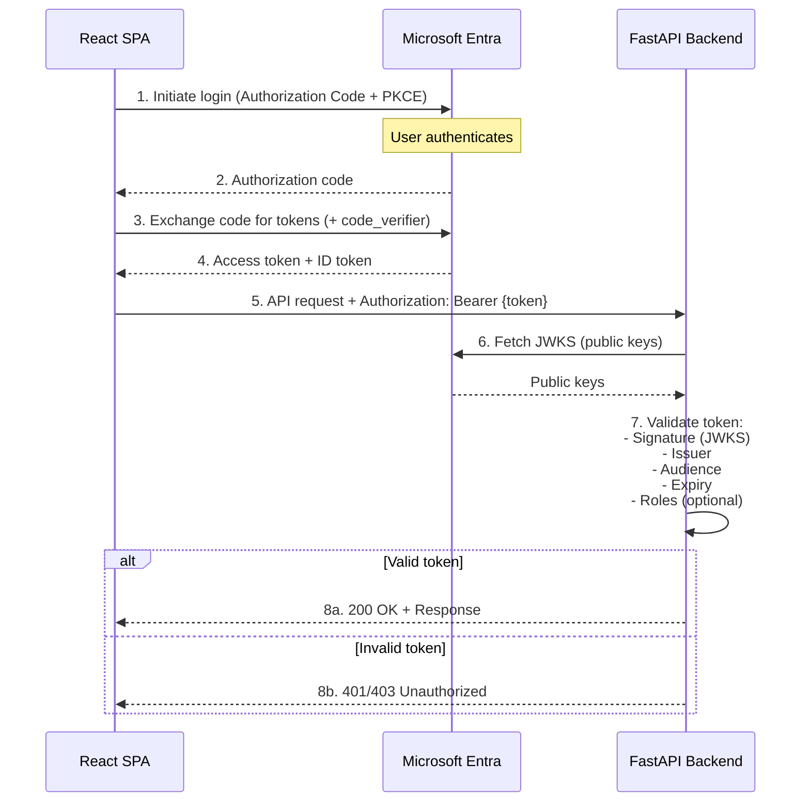

# Microsoft Entra (Azure AD) Authentication Reference

Complete guide for integrating Microsoft Entra authentication in a React SPA + FastAPI backend application.

---

## Table of Contents

### Quick Start
- [Prerequisites](#prerequisites)
- [Quick Setup (5 minutes)](#quick-setup-5-minutes)
- [Environment Variables Reference](#environment-variables-reference)

### Core Concepts
- [Architecture Overview](#architecture-overview)
- [Authentication Flow](#authentication-flow)
- [Why Two App Registrations?](#why-two-app-registrations)

### Setup Guide
- [Step 1: Create Backend API Registration](#step-1-create-backend-api-registration)
- [Step 2: Create Frontend SPA Registration](#step-2-create-frontend-spa-registration)
- [Step 3: Configure Environment Files](#step-3-configure-environment-files)
- [Step 4: Configure App Roles (Optional)](#step-4-configure-app-roles-optional)

### Testing & Verification
- [Local Testing Checklist](#local-testing-checklist)
- [Token Validation](#token-validation)
- [Testing Token Refresh](#testing-token-refresh)
- [Troubleshooting Guide](#troubleshooting-guide)

### Reference
- [Security Best Practices](#security-best-practices)
- [API Reference](#api-reference)
- [Environment Variables Quick Reference](#environment-variables-quick-reference)

---

## Prerequisites

- Azure Active Directory (Entra) tenant
- Admin access to create App Registrations
- Node.js 18+ and Python 3.11+
- Basic understanding of OAuth 2.0 and JWT tokens

---

## Quick Setup (5 minutes)

**TL;DR:** Create two app registrations (backend API + frontend SPA), expose an API scope, configure permissions, set environment variables.

1. **Backend Registration**: Create app → Expose API → Add scope `access_as_user`
2. **Frontend Registration**: Create app → Set platform to SPA → Add API permission (backend scope)
3. **Environment files**: Copy IDs to `.env` files (see [Environment Variables Reference](#environment-variables-reference))
4. **Test**: Sign in via SPA, verify token, call protected API

**Jump to**: [Detailed Setup Guide](#step-1-create-backend-api-registration)

---

## Architecture Overview

### Components

```
┌─────────────────┐         ┌─────────────────┐         ┌─────────────────┐
│   React SPA     │         │  Microsoft      │         │  FastAPI        │
│   (Frontend)    │◄───────►│  Entra (AAD)    │         │  (Backend)      │
│                 │         │                 │         │                 │
│  MSAL Browser   │         │  OAuth 2.0      │         │  JWT Validator  │
│  Auth Code+PKCE │         │  Token Issuer   │         │  Role Enforcer  │
└─────────────────┘         └─────────────────┘         └─────────────────┘
```

### Key Technologies

- **Frontend**: MSAL (msal-browser) - OAuth 2.0 Authorization Code + PKCE flow
- **Backend**: PyJWT + requests - Token validation and RBAC
- **Storage**: sessionStorage (default) or localStorage for token caching

### Security Model

- **Public Client (SPA)**: No secrets, PKCE for security
- **Protected Resource (API)**: Validates JWT signatures, issuer, audience, expiry
- **Role-Based Access Control**: Optional app roles enforced at endpoint level

---

## Authentication Flow



**Key Claims Validated**:
- `iss` (issuer): `https://login.microsoftonline.com/{TENANT_ID}/v2.0`
- `aud` (audience): Backend Application ID
- `exp` (expiry): Token not expired
- `roles` (optional): User has required role(s)

---

## Why Two App Registrations?

This project uses **separate registrations** for frontend (SPA) and backend (API).

### Advantages

| Benefit | Description |
|---------|-------------|
| **Clear separation of concerns** | SPA is public client (no secrets), API is protected resource |
| **Unambiguous token audience** | Backend scope produces tokens with `aud` matching backend ID |
| **Granular permissions** | Frontend and backend permissions managed independently |
| **Simpler RBAC** | App roles scoped to backend, easier enterprise assignments |
| **Better security** | Separate lifecycles, secret rotation, and policy enforcement |
| **Future-proof** | Easy to add confidential flows (client secrets) to backend only |

### Alternative: Single App Registration

You *could* use one app for both SPA and API, but you'd lose:
- Clear permission boundaries
- Simple token validation (audience checks)
- Independent lifecycle management

**Recommendation**: Use two registrations for production apps.

---

## Step 1: Create Backend API Registration

### 1.1 Register the Application

1. Go to [Azure Portal](https://portal.azure.com) → **Azure Active Directory** → **App registrations**
2. Click **New registration**
3. Configure:
   - **Name**: `rag-chat-backend` (or your app name)
   - **Supported account types**: 
     - *Single tenant* (recommended for internal apps)
     - *Multi-tenant* (for SaaS apps)
   - **Redirect URI**: Leave blank (not needed for API)
4. Click **Register**

### 1.2 Record Key Values

From the **Overview** page, note:

| Field | Use as | Description |
|-------|--------|-------------|
| **Directory (tenant) ID** | `AZURE_TENANT_ID` | Your Azure AD tenant identifier |
| **Application (client) ID** | `AZURE_CLIENT_ID`<br>`VITE_AZURE_BACKEND_CLIENT_ID` | Backend app identifier (used in both backend and frontend) |

### 1.3 Expose an API Scope

1. Go to **Expose an API** section
2. Click **Set** next to Application ID URI
   - Accept default: `api://{APPLICATION_CLIENT_ID}`
   - Or customize: `api://rag-chat-backend`
3. Click **Add a scope**:
   - **Scope name**: `access_as_user`
   - **Who can consent**: *Admins and users*
   - **Admin consent display name**: `Access RAG Chat API`
   - **Admin consent description**: `Allow the application to access the RAG Chat API on behalf of the signed-in user`
   - **User consent display name**: `Access RAG Chat API`
   - **User consent description**: `Allow the application to access the RAG Chat API on your behalf`
   - **State**: Enabled
4. Click **Add scope**

**Result**: Full scope URI is `api://{BACKEND_CLIENT_ID}/access_as_user`

---

## Step 2: Create Frontend SPA Registration

### 2.1 Register the Application

1. Go to **App registrations** → **New registration**
2. Configure:
   - **Name**: `rag-chat-frontend`
   - **Supported account types**: Same as backend (typically *Single tenant*)
   - **Redirect URI**: 
     - Platform: **Single-page application (SPA)**
     - URI: `http://localhost:5173`
3. Click **Register**

### 2.2 Record Key Values

From the **Overview** page:

| Field | Use as | Description |
|-------|--------|-------------|
| **Directory (tenant) ID** | `VITE_AZURE_FRONTEND_TENANT_ID` | Must match backend tenant |
| **Application (client) ID** | `VITE_AZURE_FRONTEND_CLIENT_ID` | Frontend app identifier |

### 2.3 Configure Authentication

1. Go to **Authentication**
2. Under **Single-page application** platform:
   - Verify `http://localhost:5173` is listed
   - Add production URL when ready (e.g., `https://app.yourcompany.com`)
3. **Implicit grant and hybrid flows**: Leave **unchecked** (not needed for Auth Code + PKCE)
4. Click **Save**

### 2.4 Configure API Permissions

1. Go to **API permissions** → **Add a permission**
2. **My APIs** tab → Select your backend app (`rag-chat-backend`)
3. **Delegated permissions** → Check `access_as_user`
4. Click **Add permissions**
5. Add **Microsoft Graph** → **Delegated permissions** → `User.Read` (for profile info)
6. Click **Add permissions**
7. **Grant admin consent for {Tenant}** (requires admin rights)
   - This avoids per-user consent prompts in development

**Final permissions**:
- `api://{BACKEND_CLIENT_ID}/access_as_user` (your API)
- `User.Read` (Microsoft Graph)

---

## Step 3: Configure Environment Files

### Frontend Environment (`frontend/.env`)

```bash
# Azure AD Configuration
VITE_AZURE_FRONTEND_TENANT_ID=<YOUR_TENANT_ID>
VITE_AZURE_FRONTEND_CLIENT_ID=<YOUR_FRONTEND_CLIENT_ID>
VITE_REDIRECT_URI=http://localhost:5173

# Backend API Configuration
VITE_AZURE_BACKEND_CLIENT_ID=<YOUR_BACKEND_CLIENT_ID>
VITE_AZURE_BACKEND_SCOPE=api://<YOUR_BACKEND_CLIENT_ID>/access_as_user
VITE_API_URL=http://localhost:8000
```

### Backend Environment (`.env` at repository root)

```bash
# Azure AD Configuration
AZURE_TENANT_ID=<YOUR_TENANT_ID>
AZURE_CLIENT_ID=<YOUR_BACKEND_CLIENT_ID>

# Optional: Only needed for confidential client flows
# AZURE_CLIENT_SECRET=<SECRET>
```

### Configuration Notes

1. **Tenant ID must match** between frontend and backend
2. **Backend Client ID** appears in both files:
   - Backend uses it to validate token audience
   - Frontend uses it to build the scope request
3. **Never commit** `.env` files with real credentials to version control
4. **Scope format**: `api://{BACKEND_CLIENT_ID}/access_as_user` or custom Application ID URI

---

## Step 4: Configure App Roles (Optional)

App roles enable role-based access control (RBAC) in your application.

### 4.1 Add Role to Backend App Manifest

1. Go to backend app registration → **App roles**
2. Click **Create app role**:
   - **Display name**: `RAG Chat User`
   - **Allowed member types**: *Users/Groups*
   - **Value**: `rag_chat_user`
   - **Description**: `Allows access to the RAG Chat API`
   - **Enable this app role**: Checked
3. Click **Apply**

**Manual manifest option**: Go to **Manifest** and add to `appRoles` array:

```json
{
  "allowedMemberTypes": ["User"],
  "description": "Allows access to the RAG Chat API",
  "displayName": "RAG Chat User",
  "id": "11111111-2222-3333-4444-555555555555",
  "isEnabled": true,
  "value": "rag_chat_user"
}
```

> **Note**: Generate a unique GUID for the `id` field (use `uuidgen` on macOS/Linux)

### 4.2 Assign Users to Role

1. Go to **Azure Active Directory** → **Enterprise applications**
2. Search for your backend app (`rag-chat-backend`)
3. Go to **Users and groups** → **Add user/group**
4. Select users/groups → Select role `RAG Chat User`
5. Click **Assign**

### 4.3 Verify in Code

Backend enforces roles via `require_role('rag_chat_user')` dependency:

```python
# backend/main.py
@app.get("/config")
async def config(current_user: dict = Depends(require_role('rag_chat_user'))):
    # Only users with rag_chat_user role can access
    return {"config": "..."}
```

Users without the role will receive **HTTP 403 Forbidden**.

---

## Local Testing Checklist

### 1. Start Backend

```bash
cd /path/to/repo
source .venv/bin/activate
export PYTHONPATH=$(pwd)
uvicorn backend.main:app --host 0.0.0.0 --port 8000
```

Verify `.env` is loaded (check logs for Azure config).

### 2. Start Frontend

```bash
cd frontend
npm install
npm run dev
```

Open browser to `http://localhost:5173`

### 3. Sign In and Test

1. Click **Sign in** button in the app
2. Complete Microsoft authentication
3. Open browser DevTools → Console
4. Run diagnostic commands:

```javascript
// Check MSAL accounts
window.__msal?.getAllAccounts()

// Debug token acquisition
debugAuth().then(console.log)
```

### 4. Verify Token Claims

Use browser console or [jwt.ms](https://jwt.ms) to decode the access token:

**Expected claims**:
```json
{
  "aud": "<BACKEND_CLIENT_ID>",
  "iss": "https://login.microsoftonline.com/<TENANT_ID>/v2.0",
  "scp": "access_as_user",
  "roles": ["rag_chat_user"],
  "exp": 1234567890,
  ...
}
```

### 5. Test API Calls

```bash
# Get token from DevTools (debugAuth output)
TOKEN="eyJ0eXAiOiJKV1QiLCJhbGc..."

# Test protected endpoint
curl -H "Authorization: Bearer $TOKEN" \
     http://localhost:8000/config
```

**Expected**: HTTP 200 with JSON response

---

## Token Validation

### What the Backend Validates

1. **Signature** (using JWKS from Azure)
2. **Issuer (`iss`)**: Must match `https://login.microsoftonline.com/{TENANT_ID}/v2.0`
3. **Audience (`aud`)**: Must match backend `AZURE_CLIENT_ID`
4. **Expiry (`exp`)**: Token must not be expired
5. **Roles (optional)**: If using RBAC, checks `roles` claim

### Token Validation Flow

```python
# backend/auth.py
def verify_token(token: str) -> dict:
    # 1. Fetch JWKS (cached)
    jwks = get_jwks()
    
    # 2. Decode header and find signing key
    unverified_header = jwt.get_unverified_header(token)
    rsa_key = find_signing_key(jwks, unverified_header['kid'])
    
    # 3. Verify and decode
    payload = jwt.decode(
        token,
        rsa_key,
        algorithms=['RS256'],
        audience=AZURE_CLIENT_ID,
        issuer=f"https://login.microsoftonline.com/{AZURE_TENANT_ID}/v2.0"
    )
    
    return payload
```

### Common Validation Errors

| Error | Cause | Solution |
|-------|-------|----------|
| **Invalid signature** | Token not issued by Azure or tampered | Check tenant ID, ensure token is fresh |
| **Invalid audience** | Token not for this API | Verify `AZURE_CLIENT_ID` matches backend app ID |
| **Token expired** | Token lifetime exceeded (typically 1 hour) | Refresh token or re-authenticate |
| **Invalid issuer** | Wrong tenant or v1 endpoint | Verify `AZURE_TENANT_ID`, ensure v2.0 endpoint |

---

## Testing Token Refresh

The frontend includes debug helpers for testing token refresh behavior.

### Using Debug Helpers (Browser Console)

```javascript
// 1. Check helper availability
console.log(window.__authSim)

// 2. Force a token refresh
window.__authSim.forceRefreshTokenAndLog()

// 3. Expire cached token and force refresh
window.__authSim.expireCachedAccessToken()
window.__authSim.forceRefreshTokenAndLog()

// 4. Start automatic periodic refresh (every 30 seconds)
window.__authSim.startPeriodicExpiry(30000)

// 5. Stop automatic refresh
window.__authSim.stopPeriodicExpiry()
```

### Using Debug Panel UI

The app includes a collapsible Debug Panel at the bottom of the chat interface:

1. Click **Debug Panel** to expand
2. Click **🔍 Show Claims** to view current token claims
3. Use buttons:
   - **▶️ Start 30s**: Auto-expire token every 30 seconds
   - **⏹️ Stop**: Stop auto-expiry
   - **⚡ Expire**: Immediately expire cached token

### What to Observe

**Console logs**:
```
[auth-sim] Forcing token refresh (acquireTokenSilent forceRefresh:true) for scopes: [...]
[MSAL][Info] Acquired token successfully
[auth-sim] Forced refresh response: { ... }
```

**Network tab**:
- Look for POST to `https://login.microsoftonline.com/.../token`
- Response 200 indicates successful refresh

**Session Storage** (Application tab):
- After expiry: access token keys removed
- After refresh: new token entries appear

---

## Troubleshooting Guide

### 401 Unauthorized

**Symptoms**: API returns 401, backend logs "Invalid token"

**Causes & Solutions**:
- ❌ **Token audience mismatch**
  - Check token `aud` claim matches backend `AZURE_CLIENT_ID`
  - Verify frontend requests correct scope (`VITE_AZURE_BACKEND_SCOPE`)
  
- ❌ **Wrong tenant ID**
  - Ensure `AZURE_TENANT_ID` matches between frontend and backend
  - Check token `iss` claim contains correct tenant ID
  
- ❌ **Token expired**
  - MSAL should auto-refresh; check console for errors
  - Try manual refresh: `window.__authSim.forceRefreshTokenAndLog()`

### 403 Forbidden

**Symptoms**: API returns 403 with "Missing required role"

**Causes & Solutions**:
- ❌ **User not assigned to app role**
  - Go to Azure AD → Enterprise Applications → Your app → Users and groups
  - Assign user to `rag_chat_user` role
  
- ❌ **Role not in token**
  - Sign out and sign in again to get fresh token with roles
  - Verify token contains `"roles": ["rag_chat_user"]`

### AADSTS50011: Redirect URI Mismatch

**Symptoms**: Login fails with redirect URI error

**Solutions**:
- ✅ Verify `VITE_REDIRECT_URI` matches exactly in app registration
- ✅ Check platform is set to **Single-page application** (not Web)
- ✅ Ensure no trailing slash differences (`http://localhost:5173` vs `http://localhost:5173/`)

### Token Not Being Sent from SPA

**Symptoms**: API receives requests without Authorization header

**Solutions**:
- ✅ Check `window.__msal` exists in console
- ✅ Run `debugAuth()` and verify `tokenInfo.accessToken` is present
- ✅ Check Network tab for Authorization header in API requests
- ✅ Ensure user is signed in (check `getAllAccounts()` returns accounts)

### CORS Errors

**Symptoms**: Browser blocks API requests with CORS error

**Solutions**:
- ✅ Backend allows all origins in development (see `backend/main.py`)
- ✅ For production, add frontend origin to CORS allow list
- ✅ Ensure backend is running and accessible at `VITE_API_URL`

### Interactive Authentication Required

**Symptoms**: MSAL throws `interaction_required` error

**Solutions**:
- ✅ User needs to sign in again (consent/session expired)
- ✅ App will automatically prompt for popup/redirect login
- ✅ Check browser didn't block popup window

---

## Security Best Practices

### Environment & Secrets

- ✅ **Never commit** `.env` files to version control
- ✅ Use `.gitignore` to exclude `.env` and `.env.local`
- ✅ Use **Azure Key Vault** or secure secret storage in production
- ✅ Rotate client secrets regularly (if using confidential flows)

### Token Storage

- ✅ Default: `sessionStorage` (tokens cleared on tab close)
- ⚠️ `localStorage`: Persistent across sessions but higher XSS risk
- ✅ Use HttpOnly cookies for highly sensitive scenarios (requires backend token management)

### CORS Configuration

- ✅ Development: Allow all origins for convenience
- ✅ Production: Whitelist only your frontend domain(s)
- ❌ Never use `*` (allow all) in production

### HTTPS Requirements

- ✅ Always use HTTPS in production
- ✅ Redirect HTTP to HTTPS
- ✅ Use HSTS headers to enforce HTTPS

### Token Validation

- ✅ Always validate signature, issuer, audience, and expiry
- ✅ Use role-based access control for sensitive endpoints
- ✅ Log authentication failures for security monitoring

### Least Privilege

- ✅ Request only the scopes your app needs
- ✅ Use delegated permissions (not application permissions) for user flows
- ✅ Assign app roles to specific users/groups, not broadly

---

## API Reference

### Backend Endpoints

#### `GET /auth/claims`
Returns decoded token claims for debugging.

**Authentication**: Required (access token only, no role required)

**Response**:
```json
{
  "claims": {
    "aud": "...",
    "iss": "...",
    "roles": ["rag_chat_user"],
    ...
  }
}
```

#### `GET /auth/me`
Returns current authenticated user information.

**Authentication**: Required (requires `rag_chat_user` role)

**Response**:
```json
{
  "user": {
    "oid": "...",
    "name": "...",
    "preferred_username": "...",
    "roles": ["rag_chat_user"]
  }
}
```

### Frontend Debug Helpers

Exposed on `window.__authSim`:

| Function | Description |
|----------|-------------|
| `forceRefreshTokenAndLog()` | Force silent token refresh and log result |
| `expireCachedAccessToken()` | Remove access token from session/local storage |
| `startPeriodicExpiry(ms)` | Expire token every N milliseconds |
| `stopPeriodicExpiry()` | Stop periodic expiry timer |

**Example**:
```javascript
// Force refresh and inspect new token
const response = await window.__authSim.forceRefreshTokenAndLog();
console.log('New token expires:', response.expiresOn);
```

---

## Environment Variables Quick Reference

### Frontend (`frontend/.env`)

| Variable | Required | Example | Description |
|----------|----------|---------|-------------|
| `VITE_AZURE_FRONTEND_TENANT_ID` | ✅ | `xxxxxxxx-xxxx-...` | Azure AD tenant ID |
| `VITE_AZURE_FRONTEND_CLIENT_ID` | ✅ | `xxxxxxxx-xxxx-...` | Frontend app (client) ID |
| `VITE_REDIRECT_URI` | ✅ | `http://localhost:5173` | OAuth redirect URI |
| `VITE_AZURE_BACKEND_CLIENT_ID` | ✅ | `xxxxxxxx-xxxx-...` | Backend app (client) ID |
| `VITE_AZURE_BACKEND_SCOPE` | ⚠️ | `api://xxx/access_as_user` | Full backend scope (auto-built if omitted) |
| `VITE_API_URL` | ✅ | `http://localhost:8000` | Backend API base URL |

### Backend (`.env`)

| Variable | Required | Example | Description |
|----------|----------|---------|-------------|
| `AZURE_TENANT_ID` | ✅ | `xxxxxxxx-xxxx-...` | Azure AD tenant ID (must match frontend) |
| `AZURE_CLIENT_ID` | ✅ | `xxxxxxxx-xxxx-...` | Backend app (client) ID |
| `AZURE_CLIENT_SECRET` | ❌ | `secret~value` | Only for confidential client flows |

---

## Additional Resources

- [Microsoft Entra Documentation](https://learn.microsoft.com/en-us/azure/active-directory/)
- [MSAL.js Documentation](https://learn.microsoft.com/en-us/azure/active-directory/develop/msal-overview)
- [OAuth 2.0 Authorization Code Flow](https://learn.microsoft.com/en-us/azure/active-directory/develop/v2-oauth2-auth-code-flow)
- [JWT.io - Token Decoder](https://jwt.io)
- [JWT.ms - Microsoft Token Decoder](https://jwt.ms)

---

**Last Updated**: 2025-10-19  
**Maintained By**: Project Team  
**Questions?** Open an issue in the repository
