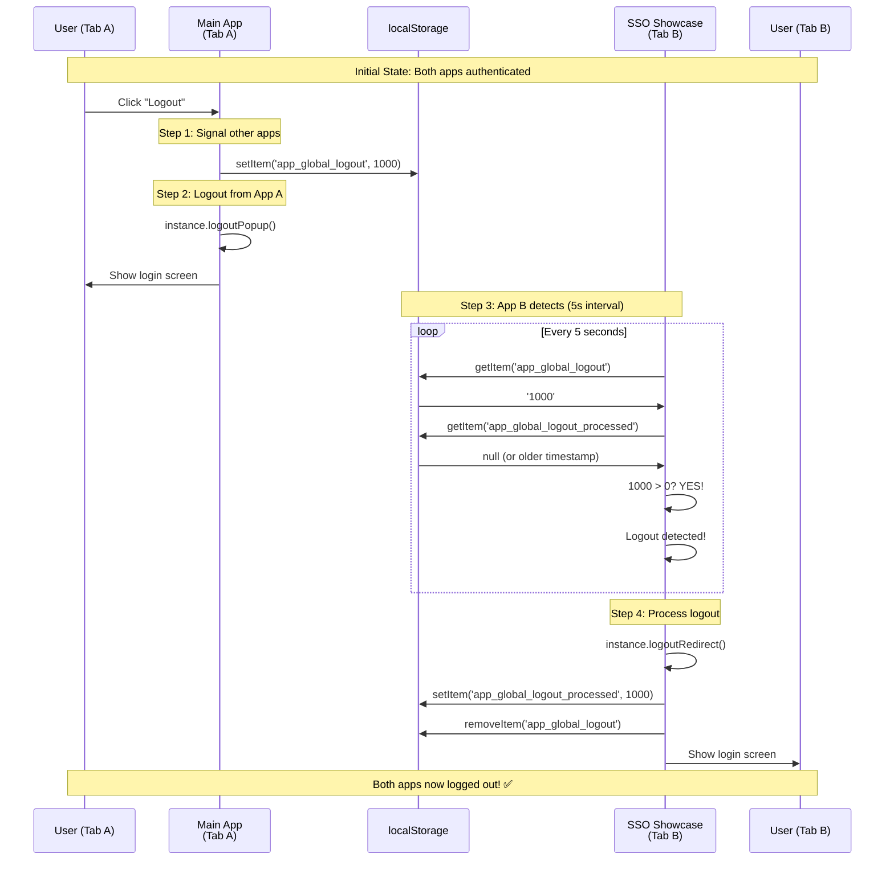

# Cross-App Logout Coordination - Explained

## The Problem You Identified

You asked why we need:
```javascript
localStorage.setItem('app_global_logout', logoutMarker);
localStorage.setItem('app_global_logout_processed', logoutMarker);
```

**Answer:** We DON'T need the second line! It was a bug. ❌

## The Bug

### What Was Happening (WRONG)

```javascript
// App A logs out
setGlobalLogoutFlags() {
  const timestamp = 1000;
  localStorage.setItem('app_global_logout', '1000');
  localStorage.setItem('app_global_logout_processed', '1000'); // ❌ BUG!
}

// App B checks
checkGlobalLogout() {
  const logoutTime = 1000;  // from 'app_global_logout'
  const lastProcessed = 1000; // from 'app_global_logout_processed'
  
  if (logoutTime > lastProcessed) { // if (1000 > 1000) = FALSE ❌
    // Never executes!
  }
}
```

**Result:** App B never detected the logout! Cross-app logout was **broken**.

## The Fix

### What Should Happen (CORRECT)

```javascript
// App A logs out
setGlobalLogoutFlags() {
  const timestamp = 1000;
  localStorage.setItem('app_global_logout', '1000'); // ✅ Set signal
  // DON'T set 'app_global_logout_processed' yet!
}

// App B checks (5 seconds later)
checkGlobalLogout() {
  const logoutTime = 1000;  // from 'app_global_logout'
  const lastProcessed = 0;  // Not set yet, defaults to 0
  
  if (logoutTime > lastProcessed) { // if (1000 > 0) = TRUE ✅
    console.log('Logout detected!');
    instance.logoutRedirect();
    markLogoutFlagProcessed(1000); // Now mark as processed
  }
}
```

**Result:** App B correctly detects and processes the logout! ✅

## How Cross-App Logout Works

### Architecture



### The Two Flags Explained

| Flag | Purpose | Set By | When Set |
|------|---------|--------|----------|
| `app_global_logout` | **Signal** that logout happened | App initiating logout | Immediately when user logs out |
| `app_global_logout_processed` | **Marker** that this app handled it | App receiving signal | After that app processes the logout |

### Why We Need Both

**Q: Why not just use one flag?**

**A:** To prevent duplicate processing and allow multiple apps to track their own state.

**Example with 3 apps:**

```javascript
// App A logs out at timestamp 1000
localStorage.setItem('app_global_logout', '1000');

// App B processes it first
checkGlobalLogout() {
  // 1000 > 0, so process
  logoutRedirect();
  localStorage.setItem('app_global_logout_processed', '1000');
}

// App C checks 1 second later
checkGlobalLogout() {
  // 1000 > 0, so process
  logoutRedirect();
  localStorage.setItem('app_global_logout_processed', '1000');
}

// App B checks again 5 seconds later
checkGlobalLogout() {
  // 1000 > 1000? NO, already processed ✅
  // Don't logout again
}
```

**Without the "processed" flag:** Apps would logout repeatedly every 5 seconds!

## Simplified Explanation

Think of it like a bulletin board:

1. **App A posts a note:** "Everyone logout at timestamp 1000"
   - `app_global_logout = 1000`

2. **App B reads the note:** "Oh, I need to logout! Let me do that..."
   - Logs out
   - Marks on their personal checklist: "I handled the 1000 logout"
   - `app_global_logout_processed = 1000` (for App B)

3. **App B checks again later:** "Is there a new logout notice?"
   - Sees notice is still 1000
   - Checks personal list: "I already handled 1000"
   - Does nothing ✅

4. **App C reads the note:** "I need to logout too!"
   - Same process as App B

## The Code Flow

### 1. App A: Initiate Logout

```javascript
// In useLogout hook
const logout = async () => {
  // Step 1: Post the logout notice
  setGlobalLogoutFlags(); // Sets app_global_logout = 1000
  
  // Step 2: Logout locally
  await instance.logoutPopup({
    account: currentAccount,
    postLogoutRedirectUri: window.location.origin,
  });
};
```

### 2. App B: Detect and Process

```javascript
// In App.jsx (runs every 5 seconds)
const checkGlobalLogout = () => {
  const logoutFlag = localStorage.getItem('app_global_logout'); // '1000'
  const lastProcessed = localStorage.getItem('app_global_logout_processed') || '0'; // '0'
  
  const logoutTime = parseInt(logoutFlag, 10); // 1000
  const processedTime = parseInt(lastProcessed, 10); // 0
  
  if (logoutTime > processedTime) { // 1000 > 0 = true
    console.log('Global logout detected, logging out...');
    
    // Mark as processed BEFORE logout to prevent race conditions
    localStorage.setItem('app_global_logout_processed', logoutTime.toString());
    localStorage.removeItem('app_global_logout');
    
    // Logout this app
    instance.logoutRedirect();
  }
};

// Check every 5 seconds
setInterval(checkGlobalLogout, 5000);
```

## Edge Cases Handled

### Case 1: Multiple Apps Open

✅ **Handled:** Each app independently checks and marks as processed

### Case 2: App Opened After Logout

```javascript
// App C opens 10 minutes after logout
checkGlobalLogout() {
  const logoutTime = 1000;
  const now = Date.now(); // e.g., 601000 (10+ minutes later)
  
  // Check if flag is old (> 5 minutes)
  if (now - logoutTime > 300000) { // true
    // Flag is stale, remove it
    localStorage.removeItem('app_global_logout');
  }
}
```

✅ **Handled:** Old flags are cleaned up automatically

### Case 3: User Logs In Again

```javascript
// In App.jsx when isAuthenticated becomes true
useEffect(() => {
  if (isAuthenticated) {
    // Clear any stale logout flags
    localStorage.removeItem('app_global_logout');
    localStorage.removeItem('app_global_logout_processed');
  }
}, [isAuthenticated]);
```

✅ **Handled:** Flags cleared on new login

### Case 4: Browser Crash During Logout

- `app_global_logout` might persist
- Next app to check will see it's old (> 5 min) and clean it up

✅ **Handled:** Time-based expiration

## Why NOT Use Browser Events?

You might ask: "Why not use `storage` event instead of polling?"

```javascript
// Could we do this?
window.addEventListener('storage', (e) => {
  if (e.key === 'app_global_logout') {
    logout();
  }
});
```

**Problems:**

1. ❌ `storage` event only fires in **OTHER tabs**, not the tab that made the change
2. ❌ Doesn't work across different origins (Main app vs SSO showcase)
3. ❌ Can be unreliable in some browsers
4. ❌ Tab might be inactive and miss the event

**Polling is more reliable** for this use case.

## Summary

### Your Question

> Why do we need both `app_global_logout` and `app_global_logout_processed`?

### The Answer

We DON'T set both in `setGlobalLogoutFlags()`! That was a bug.

**Correct flow:**

1. **App A logs out:**
   - Sets `app_global_logout = timestamp`
   - Does NOT set `app_global_logout_processed`

2. **App B detects logout:**
   - Checks if `app_global_logout` > `app_global_logout_processed`
   - If yes → logout and mark as processed

**Two flags are needed for:**
- ✅ Signal distribution (`app_global_logout`)
- ✅ Preventing duplicate processing (`app_global_logout_processed`)
- ✅ Supporting multiple apps independently

But they should **NOT** be set at the same time!

## Files Changed

✅ **Fixed:** `frontend/src/utils/logout.js`
- Removed line setting `app_global_logout_processed` in `setGlobalLogoutFlags()`
- Added better documentation
- Removed deprecated `clearMSALStorage()` function

**Result:** Cross-app logout now works correctly! 🎉
